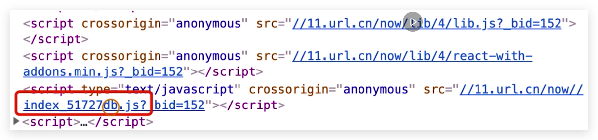

<!-- START doctoc generated TOC please keep comment here to allow auto update -->
<!-- DON'T EDIT THIS SECTION, INSTEAD RE-RUN doctoc TO UPDATE -->
## Table Of Content

- [文件指纹与文件压缩](#%E6%96%87%E4%BB%B6%E6%8C%87%E7%BA%B9%E4%B8%8E%E6%96%87%E4%BB%B6%E5%8E%8B%E7%BC%A9)
  - [生成方式](#%E7%94%9F%E6%88%90%E6%96%B9%E5%BC%8F)
  - [标识](#%E6%A0%87%E8%AF%86)
  - [代码压缩](#%E4%BB%A3%E7%A0%81%E5%8E%8B%E7%BC%A9)
    - [JavaScript压缩](#javascript%E5%8E%8B%E7%BC%A9)
    - [CSS压缩](#css%E5%8E%8B%E7%BC%A9)
    - [HTML 压缩](#html-%E5%8E%8B%E7%BC%A9)
  - [配置js指纹](#%E9%85%8D%E7%BD%AEjs%E6%8C%87%E7%BA%B9)
  - [配置css指纹](#%E9%85%8D%E7%BD%AEcss%E6%8C%87%E7%BA%B9)
  - [配置图片文件指纹](#%E9%85%8D%E7%BD%AE%E5%9B%BE%E7%89%87%E6%96%87%E4%BB%B6%E6%8C%87%E7%BA%B9)
  - [配置字体文件指纹](#%E9%85%8D%E7%BD%AE%E5%AD%97%E4%BD%93%E6%96%87%E4%BB%B6%E6%8C%87%E7%BA%B9)
  - [其他配置](#%E5%85%B6%E4%BB%96%E9%85%8D%E7%BD%AE)
- [Reference](#reference)

<!-- END doctoc generated TOC please keep comment here to allow auto update -->

### 文件指纹与文件压缩
<div style="text-align:center; margin:auto"></div>

- 用来做**版本管理**, `51727db`就是一个文件指纹
- **增量缓存**: `指纹未变动`的文件，**不会导致新的传输**，只传输指纹变更的文件

#### 生成方式
- **Hash**: hash的对象整个项目，一个变动引起全局变动，没有任何缓存效果
- **ChunkHash**: 根据不同entry，构建对应的chunk，局部变化不会引起全局变化
- **ContentHash**: js的变化会引起css的变化，即便css内容没有改变，这时候对css要用cotenthash
- [Reference](https://juejin.im/post/5a4502be6fb9a0450d1162ed)

#### 标识
 - `[hash/contenthash/chunkhash:8]`: 取前**8**位，默认**32**位

#### 代码压缩
##### JavaScript压缩
- **无需处理**: webpack4会默认使用`uglify-webpack-plugin`来进行压缩

##### CSS压缩
- **安装**: `yarn add --dev cssnano optimize-css-assets-webpack-plugin`
```javascript
  const OptimizeCSSAssetsPlugin = require('optimize-css-assets-webpack-plugin')
  // ...
  plugins: [
    new OptimizeCSSAssetsPlugin({
      assetNameRegExp: /\.css$/,
      cssProcessor: require('cssnano')
    })
  ]
```

##### HTML 压缩
- **安装**: `yarn add --dev html-webpack-plugin`
- **注意**: **一个html对应一个new HtmlWebpackPlugin配置**
```javascript
  const HtmlWebpackPlugin = require('html-webpack-plugin');
  // ...
  plugins: [
    new HtmlWebpackPlugin({
      template: path.join(__dirname, 'src/index.html'),
      filename: 'index.html',
      chunks: ['index'],
      inject: true,  //会注入js,css文件
      minify: {
        html5: true,
        collapseWhitespace: true,
        preserveLineBreaks: false,
        minifyCSS: true,
        minifyJS: true,
        removeComments: true
      }
    })
  ]
```

#### 配置js指纹
```javascript
'use strict'
const webpack = require('webpack');
const path = require('path');
module.exports = {
  entry:  {
    app: './src/index.js',
    search: './src/search.js'
  },
  output: {
    filename: '[name][chunkhash:8].js', // chunkhash
    path: __dirname + '/dist'
  }
}
```
#### 配置css指纹
- **关闭style-loader**: 因为sl是将css加入到html,而MiniCssExtract是用来将css提取到独立的文件中的，两者互斥
- **安装**: `yarn add --dev mini-css-extract-plugin` 来提取出`css`文件
```javascript
  const MiniCssExtractPlugin = require('MiniCssExtractPlugin');
  // ...
  plugins: [ // contenthash
    new MiniCssExtractPlugin({
      filename: '[name][contenthash:8].css'
    })
  ]
```
#### 配置图片文件指纹
```javascript
   module: {
     rules: [
       {
         test: /\.(png|svg|jpg|gif)$/,
         use: [{
           load: 'file-loader',
           options: {
             name: 'img/[name][hash:8].[ext]' // 这里的hash其实是contenthash
           }
         }]
       }
     ]
   }
```
#### 配置字体文件指纹
```javascript
   module: {
     rules: [
       {
         test: /\.(woff|woff2|eot|ttf|otf)$/,
         use: [{
           load: 'file-loader',
           options: {
             name: 'img/[name][hash:8].[ext]' // 这里的hash其实是contenthash
           }
         }]
       }
     ]
   }
```


#### 其他配置
- **注意:** **chunkhash**无法与**热更新**一起使用，需要在`production`模式下
- **create** `webpack.prod.js`
- **modify** `webpack.config.js` to `webpack.dev.js`
- **npm**: `"build": "webpack --confg webpack.prod.js",`
- **npm**: `"dev": "webpack-dev-server --config webpack.dev.js --open"`

### Reference
- [前端缓存策略与基于Webpack的静态资源版本管理](https://zhuanlan.zhihu.com/p/24954527)
