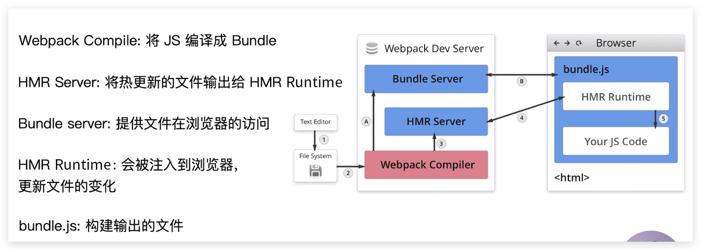

<!-- START doctoc generated TOC please keep comment here to allow auto update -->
<!-- DON'T EDIT THIS SECTION, INSTEAD RE-RUN doctoc TO UPDATE -->
## Table Of Content

- [浏览器自动刷新](#%E6%B5%8F%E8%A7%88%E5%99%A8%E8%87%AA%E5%8A%A8%E5%88%B7%E6%96%B0)
  - [webpack-dev-server](#webpack-dev-server)
  - [webpack-dev-middleware](#webpack-dev-middleware)
  - [热更新原理](#%E7%83%AD%E6%9B%B4%E6%96%B0%E5%8E%9F%E7%90%86)

<!-- END doctoc generated TOC please keep comment here to allow auto update -->

### 浏览器自动刷新
- **注意: 热更新只用在开发环境**
#### webpack-dev-server
- 参数`--open`将会**自动刷新**浏览器
- **优势**: 不输出文件，而是存在**内存**中
- **依赖**: HotModuleReplacementPlugin (自带热更新)
- **安装**: `yarn add --dev webpack-dev-server`
- **配置`webpack`**: 
```javascript
  const webpack = require('webpack');
  // ...
  mode: 'development',
  plugins: [
    new webpack.HotModuleReplacementPlugin()
  ],
  devServer: {
    contentBase: './dist', // 输出目录
    hot: true // 开启热更新
  }
```
- **配置`package.json`**: `"dev": "webpack-dev-server --open"`

#### webpack-dev-middleware
- 更加定制化
- 热更新需要配合 `webpack-hot-middle`
- web-dev-server是一个定制好的`express` + `webpack-dev-middleware` + `webpack-hot-middle`
- [用法1](https://segmentfault.com/a/1190000011761306)
- [用法2](https://andyyou.github.io/2016/05/30/webpack-dev-middleware-in-express/)

#### [热更新原理](https://time.geekbang.org/course/detail/190-98391)

<div style="text-align:center; margin:auto"></div>