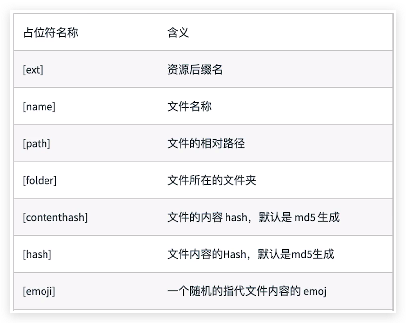

<!-- START doctoc generated TOC please keep comment here to allow auto update -->
<!-- DON'T EDIT THIS SECTION, INSTEAD RE-RUN doctoc TO UPDATE -->
## Table Of Content

- [项目梗概](#%E9%A1%B9%E7%9B%AE%E6%A2%97%E6%A6%82)
- [占位符](#%E5%8D%A0%E4%BD%8D%E7%AC%A6)

<!-- END doctoc generated TOC please keep comment here to allow auto update -->

### 项目梗概
| Project Name | Description                               |
| ------------ | ----------------------------------------- |
| Project 1    | 引入: webpack安装及配置                   |
| Project 2    | 引入: 依赖树: entry, output               |
| Project 3    | 基础: 概念: loaders, plugins, mode        |
| Project 4    | 基础: 解析es6                             |
| Project 5    | 基础: 解析jsx                             |
| Project 6    | 基础: 解析css,less,sass                   |
| Project 7    | 基础: 解析图片和字体 `file-loader `       |
| Project 8    | 基础: 解析图片 `url-loader  `             |
| Project 9    | 基础: webpack**自动重新build**            |
| Project 10   | 基础: webpack自动重新build+**刷新浏览器** |
| Project 11   | 接触: 文件指纹(增量缓存)与文件压缩        |

### 占位符

