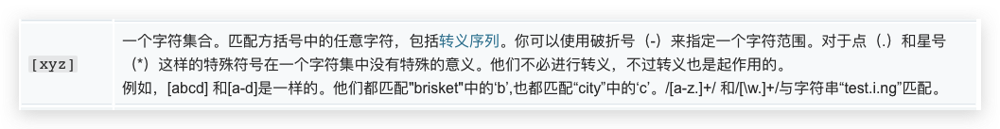
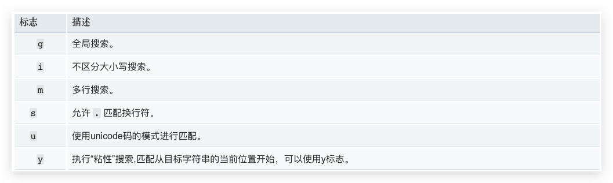

<!-- START doctoc generated TOC please keep comment here to allow auto update -->
<!-- DON'T EDIT THIS SECTION, INSTEAD RE-RUN doctoc TO UPDATE -->
## Table Of Content

- [项目梗概](#%E9%A1%B9%E7%9B%AE%E6%A2%97%E6%A6%82)
- [基本概念](#%E5%9F%BA%E6%9C%AC%E6%A6%82%E5%BF%B5)
  - [Loaders](#loaders)
    - [常用](#%E5%B8%B8%E7%94%A8)
    - [用法](#%E7%94%A8%E6%B3%95)
  - [Plugins](#plugins)
    - [常用](#%E5%B8%B8%E7%94%A8-1)
    - [用法](#%E7%94%A8%E6%B3%95-1)
  - [Mode](#mode)
- [占位符](#%E5%8D%A0%E4%BD%8D%E7%AC%A6)
- [正则表达式](#%E6%AD%A3%E5%88%99%E8%A1%A8%E8%BE%BE%E5%BC%8F)

<!-- END doctoc generated TOC please keep comment here to allow auto update -->

### 项目梗概
| Project Name | Description                                   |
| ------------ | --------------------------------------------- |
| Project 1    | **引入**: webpack安装及配置                   |
| Project 2    | **引入**: 依赖树: entry, output               |
| Project 3    | **基础**: 解析es6                             |
| Project 4    | **基础**: 解析jsx                             |
| Project 5    | **基础**: 解析css,less,sass                   |
| Project 6    | **基础**: 解析图片和字体 `file-loader `       |
| Project 7    | **基础**: 解析图片 `url-loader  `             |
| Project 8    | **基础**: webpack**自动重新build**            |
| Project 9    | **基础**: webpack自动重新build+**刷新浏览器** |
| Project 10   | **基础**: 文件指纹(增量缓存)与文件压缩        |


### 基本概念
#### Loaders
- webpack默认支持`JavaScript`和`JSON`文件
- Loaders能够提供`其他文件解析`的支持, 解析源文件，返回转换结果
##### 常用
| Name            | Description                 |
| --------------- | --------------------------- |
| `babel-loader`  | 转换es6,es7等新语法         |
| `css-loader`    | .css文件加载和解析          |
| `less-loader`   | less -> css                 |
| `ts-loader`     | ts -> js                    |
| `file-loader`   | 图片、字体打包              |
| `raw-loader `   | 将文件以字符串的形式导入    |
| `thread-loader` | 多进程打包js和css, 加快速度 |

##### 用法
```javascript
const path = require('path');
module.exports = {
  output: {
    filename: 'bundle.js'
  },
  module: {
    rules: [
      { 
        test: /\.txt$/,   // 匹配规则
        use: 'raw-loader' // Loader
      }
    ]
  }
}
```

#### Plugins
- 用于**增强**webpack，进行bundle的`优化`、资源管理和环境变量注入
- 作用域`整个构建流程`

##### 常用

| Name                     | Description                                |
| ------------------------ | ------------------------------------------ |
| CommonsChunkPlugin       | chunk相同的代码提取成公共js                |
| CleanWebpackPlugin       | 清除构建目录                               |
| ExtractTextWebpackPlugin | 将css从bundle文件里提取成一个独立的css文件 |
| CopyWebpackPlugin        | **将文件或者文件夹拷贝到构建的输出目录**   |
| HtmlWebpackPlugin        | **创建html文件去承载输出的bundle**         |
| UglifyWebpackPlugin      | 压缩JS                                     |
| ZipWebpackPlugin         | 将打包出的资源生成一个zip包                |
| ExtractTextWebpackPlugin | 将css从bundle文件里提取成一个独立的css文件 |

##### 用法
```javascript
const path = require('path');
module.exports = {
  output: {
    filename: 'bundle.js'
  },
  plugins: [
    new HtmlWebpackPlugin({
      tempalte: './src/index.html'
    })
  ]
}
```
#### Mode
- 指定NODE_ENV为`production`, `development`还是 `none`
- 就像一个切换开关，控制一些`plugins`在不同环境下的**开关**
  
| 选项        | 描述                                                                                                                                                                                                        |
| ----------- | ----------------------------------------------------------------------------------------------------------------------------------------------------------------------------------------------------------- |
| development | NODE_ENV=development;turn on `NamedChunksPlugin` and `NameModulesPlugin`                                                                                                                                    |
| production  | NODE_ENV=production; turn on `FlagDependencyUsagePlugin`, `FlagIncludedChunksPlugin`, `ModuleConcatenationPlugin`, `NoEmitOnErrorsPlugin`, `OccurrenceOrderPlugin`, `SideEffectsFlagPlugin`, `TerserPlugin` |
| none        | 不开启任何plugin                                                                                                                                                                                            |


### 占位符
<div style="text-align:center; margin:auto"></div>

### 正则表达式

<div style="text-align:center; margin:auto"></div>


<div style="text-align:center; margin:auto"></div>